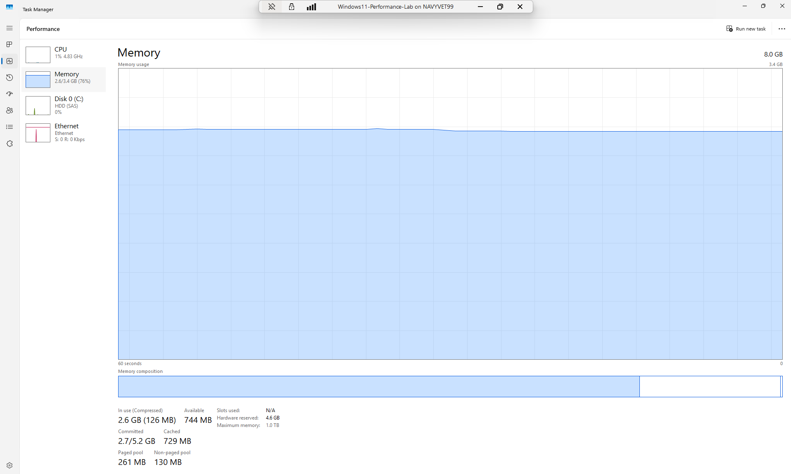
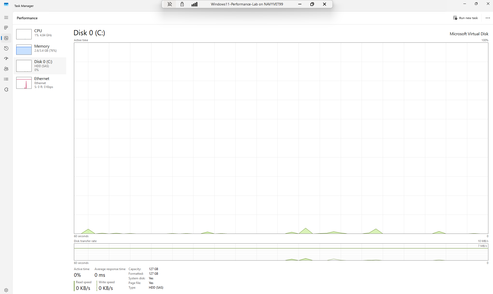
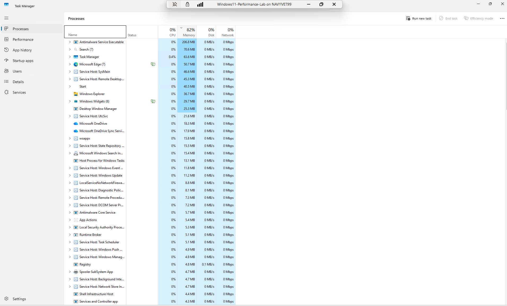
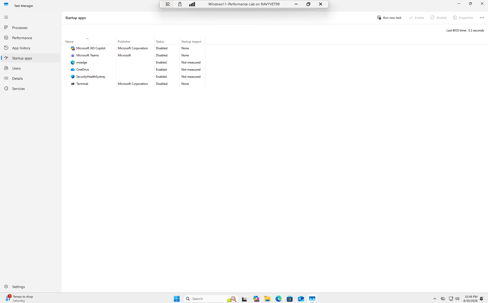
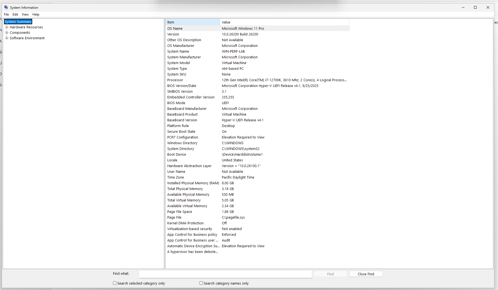
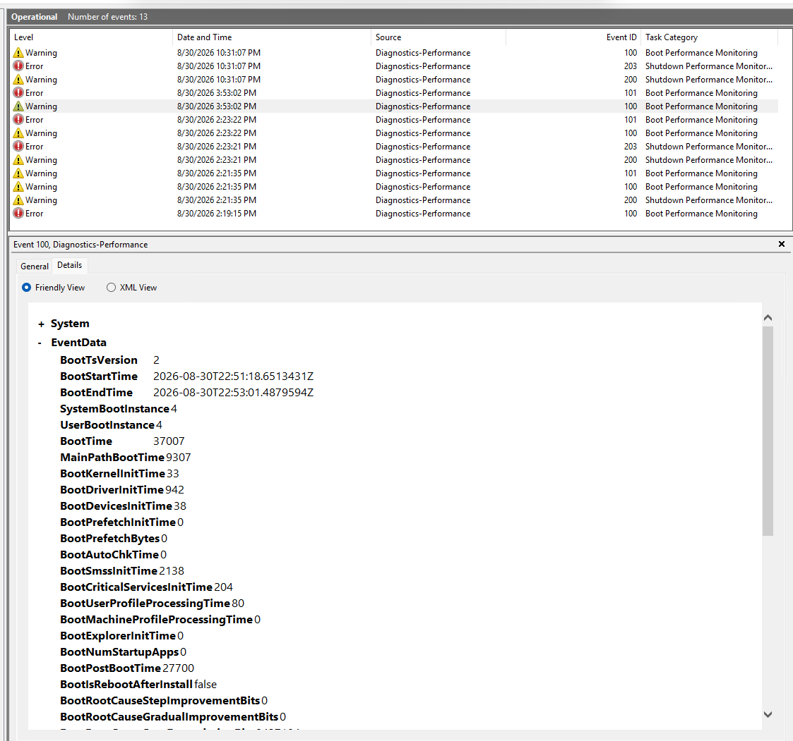
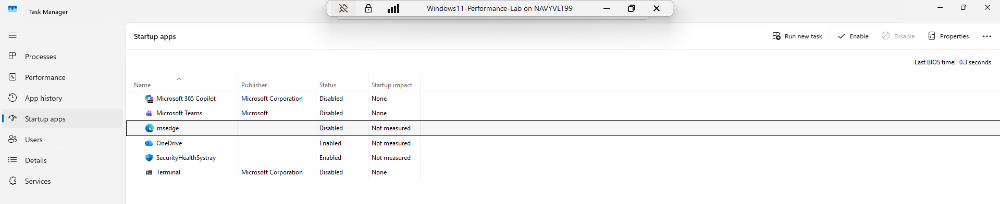
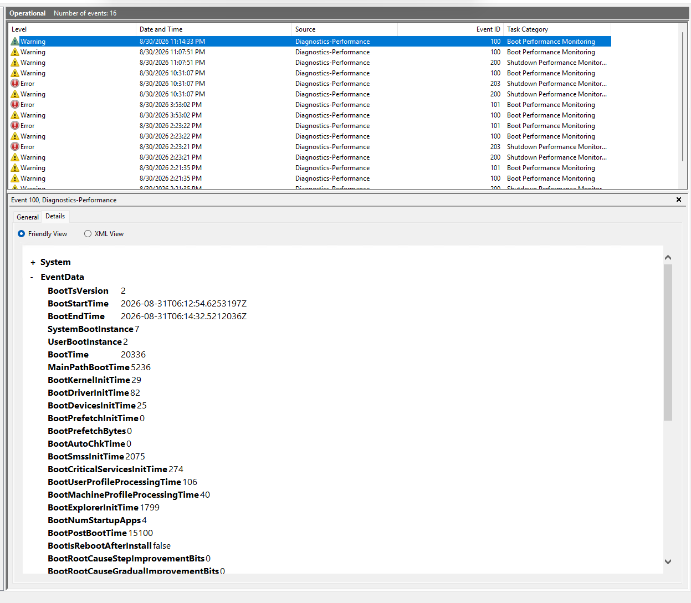

# Windows-Performance-Investigation

Hands-on Windows performance investigation using Task Manager, System Information, and Event Viewer to identify system bottlenecks, optimize startup performance, and document measurable results.

## Objective

The objective of this project was to investigate Windows 11 system performance using built-in Windows diagnostic tools, identify potential performance bottlenecks, implement a targeted optimization, and measure whether the change improved system startup performance.

The investigation followed a structured troubleshooting methodology:

**Observe → Investigate → Analyze → Resolve → Verify → Document**

## Results at a Glance

| Metric | Pre-Change | Post-Change |
|---|---:|---:|
| Average Boot Time | 26.855 seconds | 22.986 seconds |
| Fastest Recorded Boot | 21.567 seconds | 20.336 seconds |
| Samples Collected | 3 | 2 |
| Startup Change | Microsoft Edge enabled | Microsoft Edge disabled |

The collected measurements showed an approximately **14.4% lower average boot time** after the startup configuration change.

Because boot times varied between tests and the sample size was small, the results suggest an improvement but do not establish that disabling Microsoft Edge alone caused the change.

## Environment

| Component | Configuration |
|---|---|
| Operating System | Microsoft Windows 11 Pro |
| Version | 25H2 |
| OS Build | 26200 |
| Environment | Microsoft Hyper-V Virtual Machine |
| System Type | x64-based PC |
| Processor | 12th Gen Intel Core i7-12700K |
| Assigned Processors | 2 cores / 4 logical processors |
| Installed RAM | 8 GB |
| Total Physical Memory: | Approximately 3.18 GB |
| Storage | 127 GB Microsoft Virtual Disk |
| Disk Type | HDD (SAS) |
| BIOS Mode | UEFI |
| Secure Boot | Enabled |

## Tools Used

| Tool | Purpose |
|---|---|
| Task Manager | Monitored CPU, memory, disk, and network utilization and reviewed running processes and startup applications |
| System Information (`msinfo32`) | Verified the operating system, processor, memory, BIOS, Secure Boot, and virtual machine configuration |
| Event Viewer | Examined Windows Diagnostics-Performance events and Event ID 100 boot-performance data |

## Initial Performance Assessment

The investigation began by establishing a baseline of the Windows 11 virtual machine's resource utilization. Task Manager was used to examine CPU, memory, disk, network activity, running processes, and startup applications before making any configuration changes.

### Resource Utilization

| Resource | Observation |
|---|---|
| CPU | Approximately 0–1% utilization during observation |
| Memory | Approximately 76–82% utilization |
| Disk | Approximately 0–1% active utilization |
| Network | Approximately 0 Kbps during observation |

CPU, disk, and network activity were relatively low during the initial assessment. Memory utilization was noticeably higher, reaching approximately 76–82% of the memory available to the virtual machine.

### Process Review

The Processes tab was reviewed to determine which applications and services were consuming system resources. Antimalware Service Executable was the largest visible memory consumer at approximately 206.8 MB, followed by Windows Search, Task Manager, Microsoft Edge, SysMain, and other Windows services.

No single process showed unusually high CPU or disk utilization during the observation period.

### Startup Application Review

Task Manager's Startup Apps section was examined to identify applications configured to launch automatically with Windows.

The following startup applications were enabled:

- Microsoft Edge (`msedge`)
- OneDrive
- SecurityHealthSystray

Microsoft 365 Copilot, Microsoft Teams, and Terminal were already disabled.

This established the system's initial configuration before startup optimization was performed.

## Baseline Boot Performance

Windows Event Viewer was used to obtain a measurable baseline for system startup performance.

The following log was examined:

**Applications and Services Logs → Microsoft → Windows → Diagnostics-Performance → Operational**

Event ID **100 (Boot Performance Monitoring)** was reviewed because it records detailed information about the Windows startup process.

### Baseline Results

| Metric | Baseline Result |
|---|---:|
| Event ID | 100 |
| BootTime | 37,007 ms (37.007 seconds) |
| MainPathBootTime | 9,307 ms (9.307 seconds) |
| BootPostBootTime | 27,700 ms (27.700 seconds) |

### Analysis

The baseline measurement showed that the system required approximately **37.007 seconds** to complete the measured startup process.

Of that time:

- **9.307 seconds** were associated with the main boot path.
- **27.700 seconds** were recorded as post-boot processing time.

The post-boot portion accounted for approximately **75% of the total measured boot time**, making startup and post-login activity an area worth investigating.

Rather than making multiple system changes at once, the next step was to examine the applications configured to start automatically with Windows and perform a controlled optimization.

## Optimization Performed

After reviewing the baseline performance data, the Startup Apps section of Task Manager was examined to identify applications that could be prevented from launching automatically without affecting essential Windows functionality.

Microsoft Edge (`msedge`) was enabled as a startup application. Because the browser did not need to launch automatically when Windows started, it was selected for the optimization test.

### Configuration Change

**Task Manager → Startup apps → msedge → Disable**

Only one startup application was changed so that the effect of the modification could be evaluated without introducing multiple variables.

### Startup Configuration

| Application | Before | After |
|---|---|---|
| Microsoft Edge (`msedge`) | Enabled | Disabled |
| OneDrive | Enabled | Enabled |
| SecurityHealthSystray | Enabled | Enabled |
| Microsoft 365 Copilot | Disabled | Disabled |
| Microsoft Teams | Disabled | Disabled |
| Terminal | Disabled | Disabled |

OneDrive and SecurityHealthSystray were left enabled because the goal was not to disable every startup application. The objective was to make a targeted change and determine whether reducing unnecessary startup activity affected boot performance.

After the change was made, the virtual machine was restarted and Event ID 100 was examined again to obtain post-optimization measurements.

## Verification and Results

After Microsoft Edge (`msedge`) was disabled as a startup application, the Windows 11 virtual machine was restarted and boot performance was measured again using Event Viewer.

The same **Diagnostics-Performance → Operational → Event ID 100** log was used for both the baseline and post-change measurements.

### Baseline Measurements

Three boot measurements were collected before the startup configuration was changed.

| Measurement | Boot Time |
|---|---:|
| Baseline Boot #1 | 21.567 seconds |
| Baseline Boot #2 | 37.007 seconds |
| Baseline Boot #3 | 21.990 seconds |
| **Average** | **26.855 seconds** |

The 37.007-second boot was identified by Windows as a degraded boot event and was noticeably higher than the other two baseline measurements.

### Post-Change Measurements

After Microsoft Edge was disabled as a startup application, two additional boot measurements were collected.

| Measurement | Boot Time |
|---|---:|
| Post-Change Boot #1 | 25.635 seconds |
| Post-Change Boot #2 | 20.336 seconds |
| **Average** | **22.986 seconds** |

### Comparison

The average measured boot time changed from approximately **26.855 seconds before the configuration change** to approximately **22.986 seconds afterward**.

This represents a difference of approximately:

**26.855 seconds - 22.986 seconds = 3.869 seconds**

or approximately a **14.4% lower average measured boot time** in the two post-change tests.

### Interpretation

The post-change measurements suggest improved startup performance after Microsoft Edge was disabled as a startup application. However, the results should be interpreted cautiously.

One baseline boot was significantly slower than the others and was identified by Windows as degraded. Boot performance can also vary because of background services, Windows updates, caching, security activity, and other operating system processes.

Because only two post-change measurements were collected, the investigation does not establish that disabling Microsoft Edge alone caused the observed improvement.

The test demonstrates the importance of collecting multiple measurements, changing one variable at a time, and using objective evidence to evaluate system performance.

## Key Findings

The investigation produced several important findings about the Windows 11 virtual machine's performance.

### 1. Memory Was the Most Constrained Live Resource

Task Manager showed memory utilization of approximately **76–82%**, while CPU, disk, and network utilization remained relatively low during the captured observations.

Although the virtual machine had **8 GB of installed RAM**, Task Manager showed **4.6 GB as hardware reserved**, leaving approximately **3.4 GB available to Windows**. This contributed to the relatively high memory utilization observed during the investigation.

### 2. No Sustained CPU or Disk Bottleneck Was Observed

CPU utilization was approximately **0–1%**, and disk activity was approximately **0–1%** during the captured performance snapshots.

The available evidence therefore did not indicate a sustained CPU or disk bottleneck at the time of observation.

### 3. Boot Performance Varied Between Restarts

Pre-change Event ID 100 measurements ranged from **21.567 seconds to 37.007 seconds**.

The 37.007-second measurement was identified by Windows as a degraded boot event, demonstrating why a single boot measurement should not be treated as representative of overall system performance.

### 4. Startup Optimization Produced Mixed but Promising Results

After Microsoft Edge (`msedge`) was disabled as a startup application, boot measurements of **25.635 seconds** and **20.336 seconds** were recorded.

The average of the collected measurements decreased from approximately **26.855 seconds before the change** to **22.986 seconds after the change**, but the small sample size and variation between boots prevent attributing the improvement solely to Microsoft Edge.

### 5. Multiple Measurements Improved the Analysis

Comparing several Event ID 100 records provided a more accurate picture than relying on the slowest boot alone.

The investigation demonstrated that performance troubleshooting should be based on repeatable measurements and evidence rather than assumptions about which application or resource is responsible for a slowdown.

## Lessons Learned

This investigation reinforced several important principles of Windows performance troubleshooting.

### Measure Before Making Changes

Establishing baseline measurements before changing the system made it possible to compare performance before and after the optimization. Without baseline data, it would have been difficult to determine whether the configuration change had any measurable effect.

### Investigate the Bottleneck Instead of Guessing

Task Manager showed that CPU, disk, and network utilization were relatively low while memory utilization was higher. This demonstrated the importance of examining actual system resource data rather than assuming the cause of poor performance.

### Use Multiple Sources of Evidence

Task Manager provided real-time resource information, System Information provided hardware and operating system details, and Event Viewer provided measurable boot-performance data.

Using multiple Windows tools created a more complete picture of the system than relying on a single diagnostic source.

### Change One Variable at a Time

Only Microsoft Edge (`msedge`) was disabled during the startup optimization test. Limiting the change to one variable made the before-and-after comparison easier to interpret.

### One Measurement Is Not Enough

Boot times varied considerably between restarts. One pre-change boot took **37.007 seconds**, while other baseline measurements were approximately **21–22 seconds**.

Collecting multiple measurements prevented the unusually slow boot from being treated as representative of normal system performance.

### Correlation Does Not Prove Causation

Boot performance improved in the collected post-change measurements, but the available evidence was not sufficient to conclude that Microsoft Edge alone caused the difference.

Additional testing with more controlled restarts would be necessary to establish a stronger relationship between the startup configuration change and boot performance.

### Document the Entire Troubleshooting Process

A structured troubleshooting process makes technical investigations easier to reproduce, evaluate, and communicate.

This project followed the methodology:

**Observe → Investigate → Analyze → Resolve → Verify → Document**

## Skills Demonstrated

This project demonstrated practical Windows troubleshooting, performance analysis, and technical documentation skills.

| Skill | Demonstrated Through |
|---|---|
| Windows Performance Troubleshooting | Investigated CPU, memory, disk, network, processes, and startup behavior |
| Task Manager Analysis | Evaluated resource utilization, running processes, and startup applications |
| Windows Event Log Analysis | Examined Diagnostics-Performance logs and Event ID 100 boot-performance data |
| System Information Analysis | Verified operating system, hardware, memory, BIOS, Secure Boot, and virtual machine configuration |
| Performance Baseline Development | Collected multiple pre-change boot measurements for comparison |
| Root-Cause Analysis | Used system evidence to investigate potential contributors instead of assuming a cause |
| Controlled Troubleshooting | Modified one startup variable and retested system performance |
| Performance Verification | Compared pre-change and post-change Event ID 100 measurements |
| Data Interpretation | Calculated averages and evaluated variability between boot measurements |
| Technical Documentation | Documented observations, methodology, changes, results, limitations, and lessons learned |

### Troubleshooting Methodology

The investigation followed a repeatable troubleshooting workflow:

**Observe → Investigate → Analyze → Resolve → Verify → Document**

## Screenshots and Evidence

Screenshots were captured throughout the investigation to document the system environment, initial performance observations, startup configuration, Event Viewer measurements, and configuration change.

| Evidence | Description |
|---|---|
| Task Manager - Memory | Shows installed memory, current utilization, available memory, and hardware-reserved memory |
| Task Manager - Disk | Shows disk type, capacity, active time, and response time |
| Task Manager - Processes | Shows CPU, memory, disk, and network utilization during the initial assessment |
| Task Manager - Startup Apps (Before) | Documents the startup configuration before the optimization |
| System Information | Documents the Windows version, virtual machine configuration, processor, memory, BIOS mode, and Secure Boot status |
| Event Viewer - Baseline | Shows Event ID 100 boot-performance measurements collected before the configuration change |
| Task Manager - Startup Apps (After) | Shows Microsoft Edge disabled while the other selected startup applications remained unchanged |
| Event Viewer - Post-Change | Shows Event ID 100 measurements collected after the configuration change |

### Memory Utilization

Task Manager showed elevated memory utilization during the initial assessment. The system had 8 GB of installed RAM, while 4.6 GB was hardware reserved.

### Disk Activity

Disk activity was minimal during the captured performance snapshot, indicating that the disk was not experiencing sustained utilization at the time of observation.

### Process Resource Utilization

The Processes view showed approximately 82% memory utilization while CPU, disk, and network activity remained low.

### Startup Configuration Before Change

Microsoft Edge (`msedge`), OneDrive, and SecurityHealthSystray were enabled as startup applications before the optimization.

### System Information

System Information was used to document the Windows 11 virtual machine environment and hardware configuration.

### Baseline Boot Measurement

Event Viewer Event ID 100 recorded a 37.007-second boot measurement during one of the pre-change tests. Windows identified this particular boot as degraded.

### Startup Configuration After Change

Microsoft Edge (`msedge`) was disabled while the other selected startup settings remained unchanged.

### Post-Change Boot Measurement

After the startup configuration change, Event ID 100 recorded a 20.336-second boot measurement during the second post-change test.

